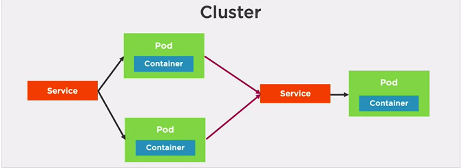
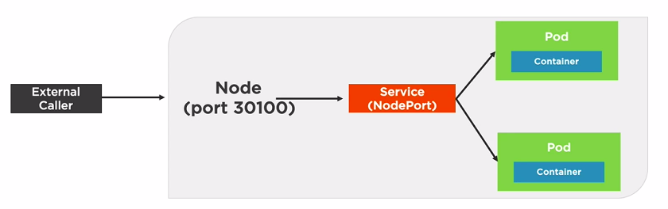
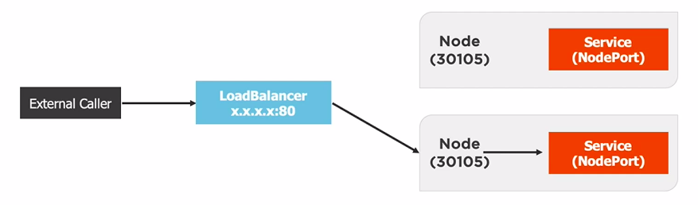
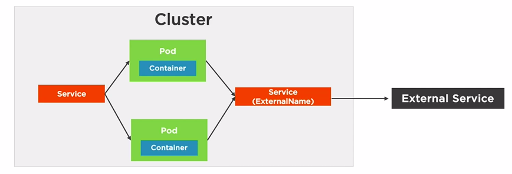

# Containers

## Benefits

* Accelerate Developer Onboarding 
* Eliminate App Conflicts 
* Environment Consistency
* Ship Software Faster

# Kubernetes 

Kubernetes (K8s) is an open-source system for automating deployment, scaling, and management of containerized applications.

## Advantages

* We can package an app and we can let kubernetes to manage it for us
* Management of containers
* Elimination of single points of failures
* Scales containers
* Updates containers without bringing down the application.
* Have a robust networking and persistent storage options.

**Conductor of containers**

**Provides a declarative way to define a cluster' state**

**Contains one or more master nodes and worker nodes(can be Physical servers,VMs).The workers nodes contains PODS which contains containers**

* POD         ----> Suit
* Container   ----> Person
* Store(etcd)(acts as a database for cluster), 
* controller manager(Takes requests and uses scheduler to perform/act upon actions),
* API Server(To interact with the cluster to give instruction to go from one state to other<--kubectl)

**Each node has a Kubelet to communicate with the master,Container runtime to run containers within the PODs and  Kube-Proxy ensures each pod has a IP address**

## Benefits

* Orchestrate Containers
* Zero-Downtime Deployements 
* Self Healings
* Scale Containers

### For Developers

* Emulate production locally
* Move from Docker Compose to Kubernetes
* Create an end-to-end testing environment
* To ensure application scales properly
* To ensure secrets/config are working properly.
* Performance testing scenarios
* Workload scenarios(CI/CD and more)
* Helps in learning how to leverage deployment options
* We can Help DevOps create resources and solve problems

## Running Locally

* Install [Minikude](https://kubernetes.io/docs/tasks/tools/install-minikube/) 
* [Docker Desktop](https://www.docker.com/products/docker-desktop) available for Mac and Windows.

Note: (To use KVM driver for ubuntu 18.04)(https://www.linuxtechi.com/install-configure-kvm-ubuntu-18-04-server/)

[Minikube drivers](https://minikube.sigs.k8s.io/docs/reference/drivers/)

Note: sudo minikube start --vm-driver=none for Ubuntu 18.04 minikube version 1.6.2 worked [minikube release](https://github.com/kubernetes/minikube/releases/)

* To install latest minikube (Linux) Installed Binary

    curl -Lo minikube https://storage.googleapis.com/minikube/releases/latest/minikube-linux-amd64 \
    && chmod +x minikube

    sudo install minikube /usr/local/bin/

## minikube Commands(Generally requires sudo)

    
    # To start a local kubernetes cluster Generally run with 
    # sudo minikube --vm-driver=none if running in host directly not in VM
    minikube start 
    minikube stop # stop a local kubernetes cluster
    minikube dashboard # access the kubernetes dashboard running within the minikube cluster
    minikube delete # deletes a local kubernetes cluster
    minikube start -p <name>' to create a new cluster, or 'minikube delete' to delete this one
    minikube status

## kubectl commands 

        kubectl version 
        kubectl cluster-info
        kubectl get all # all info about Kubernetes Pods,Deployments,Services, and more
        kubectl run [container-name]  --image=[image-name] # simple way to create a deployment for a POD
        kubectl port-forward [pod] [ports] # forward a port to allow external access
        kubectl expose [port] # expose a port for a Deployment/Pod
        kubectl create [resource]  # create a resource
        kubectl apply [resource]  # createor modify a resource 
        kubectl --help
        kubectl get pods
        kubectl get services
        
## Enabling Web UI Dashboard 

[For more Info](https://kubernetes.io/docs/tasks/access-application-cluster/web-ui-dashboard/)

        sudo minkube dashboard 

        or

        kubectl apply -f https://raw.githubusercontent.com/kubernetes/dashboard/\
        v2.0.0-beta8/aio/deploy/recommended.yaml
        kubectl describe secret -n kube-system

From above command copy the token of type **kubernetes.io/service-account-token**

        kubectl proxy

### Error:  first record does not look like a tls handshake kubernetes

Change (https to http)

http://localhost:8001/api/v1/namespaces/kubernetes-dashboard/services/https:kubernetes-dashboard:/proxy/

to 

http://localhost:8001/api/v1/namespaces/kubernetes-dashboard/services/http:kubernetes-dashboard:/proxy/

## Featues

* Service discovery and load balancing 

    Kubernetes gives Pods their own IP addresses and a single DNS name for a set of Pods, and can load-balance across them.

* Storage Orchestration

    Automatically mount the storage system of our choice, whether from local storage, a public cloud provider such as GCP or AWS, or a network storage system such as NFS, iSCSI, Gluster, Ceph, Cinder, or Flocker.

* Self Healing 

    Restarts containers that fail, replaces and reschedules containers when nodes die, kills containers that don’t respond to your user-defined health check, and doesn’t advertise them to clients until they are ready to serve.

* Automating rollouts and rollbacks

    Kubernetes progressively rolls out changes to your application or its configuration, while monitoring application health to ensure it doesn’t kill all your instances at the same time. If something goes wrong, Kubernetes will rollback the change for you. Take advantage of a growing ecosystem of deployment solutions.

* Secret and configuration management

    Deploy and update secrets and application configuration without rebuilding our image and without exposing secrets in your stack configuration.

* Horizontal scaling 

    Scale your application up and down with a simple command, with a UI, or automatically based on CPU usage.

# Pods

* A Pod is the basic execution unit of a Kubernetes application-the smallest and simplest unit in the Kubernetes object model that you create or deploy.
* Pods run containers
* Pods acts as a environment for containers.
* As a Developer we need to organise the application "parts" into **Pods** (Server, caching, APIs, database, etc.)
* Pod IP, memory, volumes, etc. shared across containers
* we can scale horizontally by adding Pod replicas
* **Pods live and die but never come back to life.** New one is created

* Pod containers share the same Network namespace(share IP/port)
* Pod containers have the same loopback network interfaces(localhost)
* Containers processes need to bind to different ports within a Pod
* Ports can be reused by containers in separate Pods
* Pods never span nodes

Note: Pods have different ips (10.0.0.33, 10.0.0.43)

## Running a Pod

Use any of the following

* kubectl run command
* kubectl create/apply command with a yaml file.

        # Run the nginx:alpine container in a Pod
        kubectl run [podname]  --image=nginx:alpine
        kubectl create deployment [podname] --image=nginx:alpine

        # Examples
        kubectl run sample-nginx-alpine-pod --image=nginx:alpine # deprecated
        kubectl create deployment nginx-pod --image=nginx:alpine

        # list only pods
        kubectl get pods
        kubectl get pods --watch
        # list all resources 
        kubectl get all

**Pods and containers are only accessible within the kubernetes cluster by default**

**One way to expose a container port externally: kubectl port-forward**

**Image to run a pod is a docker image**

        # Enable Pod Container to be 
        # called externally
        kubectl port-forward [name-of-pod]  external_port:internal_port
        kubectl port-forward pod/nginx-pod-6fc99f67cd-h4zxr  8001:80 
        # 127.0.0.1:8001 to access the application

        # will cause pod to be recreated
        kubectl delete pod [name-of-pod]
        kubectl delete pod nginx-pod-6fc99f67cd-h4zxr

        # Delete Deployment that manages the pod
        # use kubectl get all to get deployment name of the pod
        kubectl delete deployment [name-of-deployment] 
        kubectl delete deployment nginx-pod

### YAML Review

* Composed of maps and lists
* Indentation matters (be consistent!)
* Always use spaces
* Maps:
    - name:value pairs
    - Maps can contain other maps for more complex data structures
* Lists:
    - Sequence of items
    - Multipe maps can be defined in a list

#### Example

    key: value
    complexMap:
        key1: value
        key2:
        subKey: value

    items:
        - item1
        - item2
        itemsMap:
        - map1: value
            map1Prop: value
        - map2: value
            map2Prop: value

### nginx.pod.yml

    apiVersion: v1
    kind: Pod
    metadata:
      name: my-nginx
    spec:
      containers:
      - name: my-nginx
        image: nginx:alpine

### creating a Pod using YAML

    # perform a trial create and validate the YAML (validate true is default)
    kubectl create --filename file.pod.yml --dry-run --validate=true
    kubectl create -f nginx.prod.yml --dry-run --validate=true

    # Create a Pod from YAML
    # Will error if Pod already exists
    kubectl create -f file.pod.yml

    # altenative way to create or apply changes to a
    # Pod from YAML
    kubectl apply -f file.pod.yml
    kubectl apply -f nginx.prod.yml
    # above command creates a warning 
    # use --save-config when you what to use 
    # kubectl apply in future
    kubectl create -f file.prod.yml --save-config # Store current properties in resource's annotations

**--save-config** causes the resource's configuration settings to be saved in the **annotations**.Having this allows in-place changes to be made to a Pod in the future using **kubectl apply**

kubectl edit or kubectl patch can also be used to change small or subset of changes to a Pod.

    # delete a Pod
    kubectl delete pod [name-of-pod]

    # delete Pod using YAML file that created it
    kubectl delete -f file.pod.yml
    kubectl delete -f nginx.prod.yml

### nginx.pod.yml

    apiVersion: v1
    kind: Pod
    metadata:
      name: my-nginx
      labels:
        app: nginx
        rel: stable
    spec:
      containers:
      - name: my-nginx
        image: nginx:alpine
        ports:
        - containerPort: 80

Note: **labels are used in deployments**

    kubectl create -f nginx.pod.yml --save-config
    # shows output in YAML this is because of --save-config(added annotations to the o/p)
    kubectl get pod my-nginx -o yaml 
    # To troubleshoot the Pod this output is useful
    kubectl describe pod [pod-name]
    kubectl describe pod my-nginx
    kubectl apply -f nginx.pod.yml

    # to go into pod with interactive shell
    kubectl exec [pod-name] -it sh
    kubectl exec my-nginx -it sh # enter exit the shell

    kubectl edit -f nginx.pod.yml

    
 ### Error socat not found - minikube 

    kubectl port-forward my-nginx 8001:80
    
[Solution Link](https://github.com/kubernetes/minikube/issues/68#issuecomment-344346923)

if you're running the none driver, you'll need a whole host of dependencies that kubernetes requires: docker, iptables, socat, certain kernel modules enabled, etc

  sudo apt-get install socat # fixed the issue.

### Pod health

* Kubernetes relies on Probes to determine the health of a Pod container.
* A Probe is a diagnostic performed periodically by the **kubelet** on a container.
* Types of Probes
    - Liveness Probes
        * Used to determine if a Pod is healthy and running as expected.(Should a POD is to be restarted)
    - Readiness probes 
        * Used to determine if a Pod should receive requests.(When the traffic has to be routed to the pod)
* Failed Pod containers are recreated by default (restartPolicy defaults to Always)

How to check the health of the probe.It depends on the container applications.We can execute direct actions on probes.Some of them are

* ExecAction - Executes an action inside the container
* HTTPGetAction - HTTP GET request against container
* TCPSocketAction - TCP check against the containers IP address on a specified port
* Probes can have the following results 
    - Success
    - Failure
    - Unknown

#### Defining an HTTP Liveness Probe
Sample Requirements

* Check /index.html on port 80
* Wait 15 seconds
* Timeout after 2 seconds
* Check every 5 seconds
* Allow 1 failure before failing Pod

##### YAML File

        apiVersion: v1
        kind: Pod
        metadata:
          name: my-nginx
          labels:
            app: nginx
            rel: stable
        spec:
          containers:
          - name: my-nginx
            image: nginx:alpine
            ports:
            - containerPort: 80
            livenessProbe:
              httpGet:
                path: /index.html
                port: 80
              initialDelaySeconds: 15
              timeoutSeconds: 2 # default is 1
              periodSeconds: 5 # Default is 10
              failureThreshold: 1 # Default is 3

#### defining an ExecAction Liveness Probe

* Define args for container
* Define liveness probe
* Define action/command to execute

##### YAML File

        apiVersion: v1
        kind: Pod
        metadata:
          name: busybox-liveness-pod
        spec:
          containers:
          - name: busybox-liveness-pod
            image: k8s.gcr.io/busybox
            resources:
              limits:
                memory: "64Mi" # 64 MB
                cpu: "50m" # 50 millicpu (.05 cpu or 5% of the cpu)
             args:
             - /bin/sh
             - -c
             - touch /tmp/healthy; sleep 30; rm -rf /tmp/healthy; sleep 600
            livenessProbe:
              exec:
                command:
                - cat
                - /tmp/healthy
               initialDelaySeconds: 5
               periodSeconds: 5

The above one results in creation of new pods by deleting old pods after 30 seconds as /tmp/healthy file is removed.THis is repeated for new pods as well for this Pod created using above YAML file.

#### Defining a Readiness Probe

* Define readiness probe
* Check /index.html on port 80
* wait 2 seconds
* Check every 5 seconds until the probe is up and runnning.

##### YAML File

        apiVersion: v1
        kind: Pod
        metadata:
          name: my-nginx
          labels:
            app: nginx
            rel: stable
        spec:
          containers:
          - name: my-nginx
            image: nginx:alpine
            ports:
            - containerPort: 80
            readinessProbe:
              httpGet:
                path: /index.html
                port: 80
              initialDelaySeconds: 2
              periodSeconds: 5

**Indetion is very important in YAML file. If any there is a problem it may result in unknown validation field error**

**Health checks provide a way to notify Kubernetes when a Pod has a problem**

# Deployments

* A **ReplicalSet** is a declarative way to manage Pods.

* A **Deployment** is a declarative way to manage Pods using a ReplicaSet.

Deployments and ReplicaSets ensure Pods stay running and can be used to scale Pods.

## ReplicaSets

- Self-healing mechanism(Fault-tolerence)
- Ensure the requested number of pods are available
- Can be used to scale Pods (Horizontally)
- Relies on a Pod template
- No need to create Pods directly
- Used by Deployments

## Deployment manages Pods

- Pods are managed using ReplicaSets
- Scales ReplicaSets, which scale Pods
- Supports zero-downtime updates by creating and destroying ReplicaSets
- Provides rollback functionality
- Creates a unique label that is assigned to the ReplicaSet and generated Pods
- YAML is very similar to a ReplicaSet

### Defining Deployments (High-Level)

        apiVersion: apps/v1 # Kubernetes API version
        kind: Deployemnt  # Resource type
        metadata: # Metadata about the Deployment 
        spec:
          selector: # Select Pod template label(s)
          template: # template used to create the Pods
            spec:
              containers: # Containers that will run in the Pod.
              - name: my-nginx
                image: nginx:alpine

### Defining a Deployment

* Kubernetes API version and resource type(Deployment)
* Metadata about the Deployment 
* The Selector is used to "select" the template to use(based on labels)
* Template to use to create the Pod/Containers(note that the selector matches the label)

        apiVersion: apps/v1
        kind: Deployment
        metadata:
          name: frontend
          labels:
            app: my-nginx
            tier: frontend
        spec:
          selector:
            matchLabels:
              tier: frontend
          template:
            metadata:
              labels:
                tier: frontend
            spec:
              containers:
              - name: my-nginx
                image: nginx:alpine
                livenessProbe:
                  httpGet:
                    path: /index.html
                    port: 80
                  initialDelaySeconds: 15
                  timeoutSeconds: 2
                  periodSeconds: 5
                  failureThreshold: 1

### Commands(kubectl + Deployments)

        # Create a deployment
        kubectl create -f file.deployment.yml
        # Alternate way to create or apply changes to a 
        # Deployment from YAML
        kubectl apply -f file.deployment.yml
        # Use --save-config when you want to use
        # kubectl apply in the future
        kubectl create -f file.deployment.yml --save-config
        # List all deployments
        kubectl get deployments
        kubectl get deployments --show-labels # Deployments and their labels
        # get all deployments with a specific label
        kubectl get deployments -l app=nginx
        # Delete Deployment (All associated Pods/Containers)
        kubectl delete deployment [deployment-name]

### Scaling Pods Horizontally

Update the YAML file or use the kubectl scale command

        # Scale the Deployment Pods to 5
        kubectl scale deployment [deployment-name]  --replicas=5

        # Scale by referencing the YAML file
        kubectl scale -f file.deployment.yml --replicas=5

        spec:
          replicas: 3
          selector:
            tier: frontend

#### Examples

        kubectl create -f  nginx.deployment.yml --save-config
        kubectl describe deployment my-nginx
        kubectl get deploy
        kubectl get deployment
        kubectl get deployments
        kubectl get deployments --show-labels
        kubectl get deployments -l app=nginx
        kubectl scale -f nginx.deployment.yml --replicas=3
        kubectl delete -f nginx.deployment.yml

#### YAML File

        apiVersion: apps/v1
        kind: Deployment
        metadata:
          name: my-nginx
        labels:
          app: my-nginx
        spec:
          replicas: 2
          selector:
            matchLabels:
              app: my-nginx
          template:
            metadata:
              labels:
                app: my-nginx
            spec:
              containers:
              - name: my-nginx
                image: nginx:alpine
                ports:
                - containerPort: 80
                resources:
                  limits:
                    memory: "128Mi" # 128 MB No spaces between 128 and Mi
                    cpu: "200m" # 200 millicpu (0.2 cpu or 20% of the cpu)

### Deployment Options

* Zero downtime deployments allow software updates to be deployed to production without impacting end users.
* One of the strengths of Kubernetes is zero downtime deployments
* Update an applications Pods without impacting end users
* Several Options are availabe
    - Rolling updates
    - Blue-green deployments(A&B)(Mutiple environments are running with same environment)
    - Canary deployments (Very small amount of traffic comes to new version)
    - Rollbacks

### Rolling Deployments

If our applications contains 3 replicas of appV1 and if we want roll to appV2, here new pods with appV2 are created one by one and after successful creation of one Pod then one of old pod is removed and this repeated until all desired nodes are created.So there zero downtime in the application.

Update a deployment by changing the YAML and applying changes to the cluster with kubectl apply

        # Apply changes made in a YAML file
        kubectl apply -f file.deployment.yml

        apiVersion: apps/v1
        kind: Deployment
        metadata:
          name: node-app
        spec:
          replicas: 2
          minReadySeconds: 10
          selector:
            matchLabels:
              app: node-app
          template:
            metadata:
              labels:
                app:node-app
            spec:
              containers:
              - image: node-app:1.0
                name: node-app
                resources:

Note: minReadySeconds: 10 # waits 10 seconds after container is started ensuring it didnot crash in first 10 seconds to get the traffic

[Demo Project](https://github.com/gireeshcse/docker-projects/tree/master/nodejs_apps_to_demonstrate_zero_downtime_kubernetes)

# Services

* A **Service** provides a single point of entry for accessing one or more Pods.

We can't rely on IP address of Pods because these change a lot.So we need need services since Pods may only live for a short time.

Also Pods can be horizontally scaled so each Pod get its own IP address.

A Pod gets an IP address after it has been scheduled(No way for clients to know IP ahead of time)

## Role of services

* Services abstract Pod IP addresses from consumers
* Load balances between Pods
* Relies on labels to associate a service with a Pod.
* Node's **kube-proxy** creates a virtual IP for services
* Uses Layer 4 (TCP/UDP over IP)
* Services are not ephemeral(Not short lived)
* Creates endpoints which sit between a Service and Pod
* Services load balances the pods

Note: **Once the connection to Pod is established all the user requests will come to this Pod if it is alive.**

## Service Types

- ClusterIP - Expose the service on a cluster-internal IP (Default)
- NodePort  - Expose the service on each Node's IP at a static port.
- LoadBalancer - Provision an external IP to act as a load balancer for the service.
- ExternalName - Maps a service to a DNS name

### ClusterIP Service

* Service IP is exposed internally within the cluster
* Only Pods within the cluster can talk to the Service
* Allows Pods to talk to other Pods

### NodePort Service

* Exposes the service on each Node's IP at a static port.
* Allocates a port from a range (default is 30000-32767)
* Each Node proxies the allocated port.

Helpful for testing to reach a particular Pod using NodePort Service.

### LoadBalancer Service

* Exposes a Service externally
* Useful when combined with a cloud provider's load balancer
* NodePort and ClusterIP Services are created.
* Each Node proxies the allocated port

### ExternalName Service

* Service that acts as an alias for an external service
* Allows a Service to act as the Proxy for an external service
* External service details are hidden from cluster(Easier to change)

## Creating a Service

    # Listen on port 8080 locally and forward to port 80 in Pod
    kubectl port-forward pod/[pod-name]  8080:80

    # Listen on port 8080 locally and forward to
    kubectl port-forward deployment/[deployment-name] 8080

    # Listen on port 8080 locally and forward to Service's Pod
    kubectl port-forward service/[service-name] 8080

    # Examples
    kubectl port-forward pod/node-app-85dcdf447c-mj6sv 8080:8080
    kubectl port-forward deployment/node-app 8080
    kubectl port-forward deployment/node-app 9000:8080

**port-forward is used for debugging and testing**

### Defining Services with YAML

      apiVersion: v1 # Kubernetes API version
      kind: Service  # resource type
      metadata:   # Metadata of the service
      spec:
        type:  # Type of service(ClusterIP,NodePort,LoadBalancer)
               # Defaults to ClusterIP
        selector: # Select Pod template label(s) 
                  # that service will apply to

        ports: # Define container target port and the
               # port for the service

#### Example (ClusterIP)

        apiVersion: v1 # Kubernetes API version
        kind: Service  # resource type
        metadata:   # Metadata of the service
          name: node-app # Name of Service
                         # each service gets a DNS entry
          labels:
            app: node-app
        spec:
          selector:
            app: node-app # Service will apply to the resource 
                          # with a label of app: node-app
          ports:
          - name: http
            port: 8080       # Port of the Service
            targetPort: 8080 # Container Port

Suppose there are two services with names **frontend** and **backend**. Now a frontend Pod can access a backend Pod using a backend:port

#### Example (NodePort)

        apiVersion: v1 # Kubernetes API version
        kind: Service  # resource type
        metadata:   # Metadata of the service
          name: node-app # Name of Service
                         # each service gets a DNS entry
          labels:
            app: node-app
        spec:
          selector:
            type: NodePort
            app: node-app # Service will apply to the resource 
                          # with a label of app: node-app
          ports:
          - name: http
            port: 8080       # Port of the Service
            targetPort: 8080 # Container Port
            nodePort: 31000  # Optionally set b/w 30000-32767

Note: I can access the service using 127.0.0.1:31000 by not localhost:31000(Ubuntu 18.04)

#### Example (LoadBalancer)

        apiVersion: v1 # Kubernetes API version
        kind: Service  # resource type
        metadata:   # Metadata of the service
          name: node-app # Name of Service
                         # each service gets a DNS entry
          labels:
            app: node-app
        spec:
          selector:
            type: LoadBalancer  # normally used  with cloud providers
            app: node-app # Service will apply to the resource 
                          # with a label of app: node-app
          ports:
          - port: 8080       # Port of the Service defaults to 80
            targetPort: 8080 # Container Port

#### Example (ExternalName)

* Other Pods can use this FQDN to access the external service
* Service will proxy to FQDN

        apiVersion: v1 # Kubernetes API version
        kind: Service  # resource type
        metadata:   # Metadata of the service
          name: external-service
          labels:
            app: node-app
        spec:
          selector:
            type: ExternalName
            externalName: api.acmecorp.com
          ports:
          - port: 9000       # Port of the Service defaults to 80

### Commands

      # Creates CusterIP if we have not specified type
      kubectl create -f file.service.yml 

      # Update a Service
      # Assumes --save-config was used with create
      kubectl apply -f file.service.yml

      # Shell into a Pod and test a URL. Add -c [containerID]
      # in cases where multiple containers are running in the Pod
      kubectl exec [pod-name]  -- curl -s http://podIP

      # Install and use curl (example Alpine Linux)
      kubectl exec [pod-name] -it sh
      > apk add curl
      > curl -s http://podIP

### Example standalone.pod.yml

      apiVersion: v1
      kind: Pod
      metadata:
        name: node-app
      spec:
        containers:
        - name: node-app
          image: gireeshcse/node-demo-k8:v3

      kubectl create -f standalone.pod.yml --save-config
      kubectl get pods
      # Output of above command first one is standalone Pod
      NAME                        READY   STATUS    RESTARTS   AGE
      node-app                    1/1     Running   0          6m9s
      node-app-85dcdf447c-mj6sv   1/1     Running   0          108m
      node-app-85dcdf447c-x7492   1/1     Running   0          108m
      # to Get IP of pod
      kubectl get pod node-app-85dcdf447c-mj6sv -o yaml
      kubectl describe pod node-app-85dcdf447c-mj6sv
      # The above commands output contains
      # podIP: 172.17.0.6  # First Command
      # IP: 172.17.0.6  # 2nd Command

      # open shell prompt in standalone Pod 
      kubectl exec node-app -it sh
      # uname -a
      Linux node-app 5.0.0-29-generic #31~18.04.1-Ubuntu SMP Thu Sep 12 18:29:21 UTC 2019 x86_64 GNU/Linux
      # curl http://172.17.0.6:8080
      Hello World! Version1 -- node-app-85dcdf447c-mj6sv

      # clusterIP.service.yml

      apiVersion: v1
      kind: Service
      metadata:
        name: nodeapp-clusterip
      spec:
        type: ClusterIP
        selector:
          app: node-app
        ports:
        - port: 8001
          targetPort: 8080

      kubectl apply -f clusterIP.service.yml
      kubectl get services
      # Output
      NAME                TYPE        CLUSTER-IP      EXTERNAL-IP   PORT(S)    AGE
      kubernetes          ClusterIP   10.96.0.1       <none>        443/TCP    71d
      nodeapp-clusterip   ClusterIP   10.96.251.157   <none>        8001/TCP   52s

      # open shell prompt in standalone Pod 
      kubectl exec node-app -it sh
      # curl 10.96.251.157:8001
      Hello World! Version1 -- node-app-85dcdf447c-x7492
      # curl http://nodeapp-clusterip:8001
      Hello World! Version1 -- node-app-85dcdf447c-x7492

      kubectl exec node-app-85dcdf447c-x7492 -it sh
      # curl http://nodeapp-clusterip:8001
      Hello World! Version1 -- node-app-85dcdf447c-mj6sv

      kubectl get pods
      NAME                        READY   STATUS    RESTARTS   AGE
      node-app                    1/1     Running   0          31m
      node-app-85dcdf447c-mj6sv   1/1     Running   0          133m
      node-app-85dcdf447c-x7492   1/1     Running   0          133m

      # Delete the service
      kubectl delete -f clusterIP.service.yml

The above demonstrates pods calling pods. Used for debugging

### NodePort

      # standalone.pod.yml

      apiVersion: v1
      kind: Pod
      metadata:
        name: node-app-standalone
      spec:
        containers:
        - name: node-app-standalone
          image: gireeshcse/node-demo-k8:v3

      kubectl create -f standalone.pod.yml --save-config

      # nodeport.service.yml
      
      apiVersion: v1
      kind: Service
      metadata:
        name: nodeapp-nodeport
      spec:
        type: NodePort
        selector:
          app: node-app
        ports:
        - port: 8080
          targetPort: 8080
          nodePort: 31000

      kubectl apply -f nodeport.service.yml
      kubectl get services
      # O/p of above command
      NAME               TYPE        CLUSTER-IP      EXTERNAL-IP   PORT(S)          AGE
      kubernetes         ClusterIP   10.96.0.1       <none>        443/TCP          71d
      nodeapp-nodeport   NodePort    10.96.201.120   <none>        8001:31000/TCP   38s

      # Worked for
      http://127.0.0.1:31001/
      # http://localhost:31001 didn't work

      # Delete
      kubectl delete -f nodeport.service.yml

Here it is exposed to the outside the cluster.

### LoadBalancer

      # loadbalancer.service.yml
      apiVersion: v1
      kind: Service
      metadata:
        name: nodeapp-loadbalancer
      spec:
        type: LoadBalancer
        selector:
          app: node-app
        ports:
        - name: "8002"
          port: 8002
          targetPort: 8080

      kubectl create -f loadbalancer.service.yml --save-config

      kubectl get services
      # Output
      NAME                           TYPE           CLUSTER-IP    EXTERNAL-IP   PORT(S)          AGE
      service/kubernetes             ClusterIP      10.96.0.1     <none>        443/TCP          71d
      service/nodeapp-loadbalancer   LoadBalancer   10.96.9.158   <pending>     8080:31309/TCP   3m58s

      # For Docker Destop EXTERNAL-IP of load-balancer will be localhost
      # You can access localhost:8080

      # For Minikube
      sudo minikube service nodeapp-loadbalancer
      |-----------|----------------------|-------------|--------------------------|
      | NAMESPACE |         NAME         | TARGET PORT |           URL            |
      |-----------|----------------------|-------------|--------------------------|
      | default   | nodeapp-loadbalancer |        8080 | http://192.168.1.4:31309 

      # to access http://192.168.1.4:31309

# Storage Options

* To store application state/data and exchange it between Pods with Kubernetes -- We need **Volumes**.
* A **Volume** can be used to hold data and state for Pods and containers.
* A Pod can have multiple Volumes attached to it.
* Containers rely on a mountPath to access a Volume.

* Kubernetes suppots:
  - Volumes
  - PersistentVolumes
  - PersistentVolumeClaims
  - StorageClasses

* A Volume references a storage location
* Must have a unique name
* Attached to a Pod and may or may not be tied to the Pod's lifetime (depending on the Volume type)
* A Volume Mount references a Volume by name and defines a mountPath

## Volumes Type Examples

* **emptyDir**- Empty directory for storing transient data(shares a Pod's lifetime) useful for sharing files between containers running in a Pod.
* **hostPath**- Pod mounts into the nodes filesystem.
* **nfs** - an NFS(Network file System) share mounted into the Pod
* **configMap/secret** - Special types of voumes that provide a Pod with access to Kubernetes resources.
* **persistentVolumeClaim** - Provides Pods with a more persistent storage option that is abstracted from the details.
* **Cloud** - Cluster-wide storage.

### Defining an emptyDir Volume

      apiVersion: v1
      kind: Pod
      metadata:
        name: nginx-alpine-volume
      spec:
        volumes:
          - name: html # Define Initial Volume 
            emptyDir: {} # Lifetime of the Pod
        containers:
        - name: nginx
          image: nginx:alpine
          volumeMounts:
            - name: html # Reference "html" Volume
              mountPath: /usr/share/nginx/html
              readOnly: true
        - name: html-updater
          image: alpine
          command: ["bin/sh","-c"]
          args: # updates latest date every 10 sec
            - while true; do date >> /html/index.html;
                sleep 10; done
          volumeMounts:
            - name: html # Reference "html" Volume
              mountPath: /html

      # Commands
      kubectl create -f emptydir.pod.yml --save-config
      kubectl port-forward nginx-alpine-volume 8080:80

2 containers one is creating and other is displaying

### Defining an hostPath Volume

        apiVersion: v1
        kind: Pod
        metadata:
          name: docker-volume
        spec:
          volumes:
            - name: docker-socket # Define a socket volume
              hostPath: # on host
                path: /var/run/docker.sock
                type: Socket
          containers:
          - name: docker
            image: docker
            command: ["sleep"]
            args: ["100000"]
            volumeMounts:
              - name: docker-socket # Reference "html" Volume
                mountPath: /usr/share/nginx/html

Valid types include 
  - DirectoryOrCreate
  - Directory
  - FileOrCreate
  - File
  - Socket
  - CharDevice
  - BlockDevice

        #Commands
        kubectl create -f hostpath.pod.yml --save-config

        kubectl describe pod docker-volume
        #Contains following info
        Volumes:
        docker-socket:
          Type:          HostPath (bare host directory volume)
          Path:          /var/run/docker.sock
          HostPathType:  Socket
        default-token-g5sp9:
          Type:        Secret (a volume populated by a Secret)
          SecretName:  default-token-g5sp9
          Optional:    false

        kubectl exec docker-volume -it sh

The volumes key should be at the same level as containers (In deployments file)

### Cloud Volumes

- Azure - Azure Disk and Azue File
- AWS - Elastic Block Store
- GCP - GCE Persistent Disk

#### azure.pod.yml

        apiVersion: v1
        kind: Pod
        spec:
          volumes:
            - name: data
              azureFile:
                secretName: <azure-secret>
                shareName: <share-name>
                readOnly: false
          containers:
          - name: my-app
            image: someimage
            volumeMounts:
              - name: data # Reference "data" Volume
                mountPath: /data/storage

#### aws.pod.yml

        apiVersion: v1
        kind: Pod
        spec:
          volumes:
            - name: data
              awsElasticBlockStore:
                volumeID: <volume_ID>
                fsType: ext4
          containers:
          - name: my-app
            image: someimage
            volumeMounts:
              - name: data # Reference "data" Volume
                mountPath: /data/storage

#### gcp.pod.yml

          apiVersion: v1
          kind: Pod
          spec:
            volumes:
              - name: data
                gcePersistentDisk:
                  pdName: datastorage
                  fsType: ext4
            containers:
            - name: my-app
              image: someimage
              volumeMounts:
                - name: data # Reference "data" Volume
                  mountPath: /data/storage

      # To see info about volumes
      kubectl describe pod [pod-name]
      kubectl get pod [pod-name] -o yaml

### PersistentVolume(PV)

* A **PersistentVolume(PV)** is a cluster-wide storage unit provisioned by an administrator with a lifecycle independent from a Pod.
* A **PersistentVolumeClaim(PVC)** is a request for a storage unit (PV).

- A PersistentVolume is a cluster-wide storage resource that relies on network-attached storage(NAS)
- Normally provisioned by a cluster administrator
- Available to a Pod even if it gets rescheduled to a different Node
- Rely on a storage provider such as NFS, cloud storage, or other options
- Associated with a Pod using a PersistentVolumeClaim(PVC)

#### azure.persistentvolume.yml

        apiVersion: v1
        kind: PersistentVolume
        metadata:
          name: my-pv
        spec:
          capacity: 10Gi
          accessModes:
            - ReadWriteOnce # One client can mount for read/write
            - ReadOnlyMany # Many clients can mount for reading 
          persistentVolumeReclaimPolicy: Retain 
          # Retain even after claim is deleted
          azureFile:
            secretName: <azure-secret>
            shareName: <name_from_azure>
            readOnly: false

#### pesistentvolumeclaim.yml

        kind: PesistentVolumeClaim
        apiVersion: v1
        metadata:
          name: pv-dd-account-hdd-5g
          annotations:
            volume.beta.kubernetes.io/storage-class: accounthdd
        spec:
          accessModes:
          - ReadWriteOnce
          resources:
            requests:
              storage: 5Gi

#### persistentclaim.pod.yml

        apiVersion: v1
        kind: Pod
        metadata:
          name: pod-uses-account-hdd-5g
          labels:
            name: storage
        spec:
          containers:
          - name: az-c-01
            image: nginx
            command: ["bin/sh","-c"]
            args: # updates latest date every 1 sec
              - while true; do echo $(date) >> /mnt/blobdisk/outfile;
                  sleep 1; done
            volumeMounts:
              - name: blobdisk01 # Reference "blobdisk01" Volume
                mountPath: /mnt/blobdisk
          volumes:
            - name: blobdisk01 # Define  Volume 
              persistentVolumeClaim:
                claimName: pv-dd-account-hdd-5g

## Storage Class

* A **StorageClass(SC)** is a type of storage template that can be used to dynamically provision storage.
* Used to define different classes of storage
* Act as a type of storage template
* Supports dynamic provisioning of PersistentVolumes
* Adminstrators don't have to create PVs in advance.

### Define LocalStorage

    apiVersion: storage.k8s.io/v1
    kind: StorageClass
    metadata:
      name: local-storage
    reclaimPolicy: Retain # Default delete after PVC is released
    provisioner: kubernetes.io/no-provisioner # Provisioner Used to create PV resource
    volumeBindingMode: WaitForFirstConsumer 
    #Wait to create until Pod making PVC is created
    #Default is immediate(ceate once PVC is created)

### Defining Local Storage PV

      apiVersion: v1
      kind: PesistentVolume
      metadata:
        name: my-pv
      spec:
        capacity:
          storage: 10Gi
        volumeMode: Block
        accessModes:
        - ReadWriteOnce
        storageClassName: local-storage # Reference Storage class
        local:
          path: /data/storage # Path where data is stored on Node
        nodeAffinity:
          required:
            nodeSelectorTerms:
            - matchExpressions:
              - key: kubernetes.io/hostname
                operator: In
                values:
                - <node-name>

In above, It selects the Node where the local storage PV is created based on conditions

### PesistentVolume Claim

        apiVersion: v1
        kind: PersistentVolumeClaim
        metadata:
          name: my-pvc
        spec:
          accessModes:
          - ReadWriteOnce
          storageClassName: local-storage
          resources:
            requests:
              storage: 1Gi

### Using PVC

      apiVersion: apps/v1
      kind: [Pod | Deployment | StatefulSet]

      ...
        spec:
          volumes:
          - name: my-volume
            persistentVolumeClaim:
              claimName: my-pvc

### Kubernetes StatefulSet

Manages the deployment and scaling of a set of Pods, and provides guarantees about the ordering and uniqueness of these Pods.

Like a Deployment , a StatefulSet manages Pods that are based on an identical container spec. Unlike a Deployment, a StatefulSet maintains a sticky identity for each of their Pods. These pods are created from the same spec, but are not interchangeable: each has a persistent identifier that it maintains across any rescheduling.

StatefulSets are valuable for applications that require one or more of the following.

* Stable, unique network identifiers.
* Stable, persistent storage.
* Ordered, graceful deployment and scaling.
* Ordered, automated rolling updates.

# ConfigMaps and Secrets

* Provides a way to a store cofiguration info and provide it to containers.
* Provides a way to inject configuration data into a container.
* Can store entire files or provide key/value pairs.

Access from Pod
  - Environment variables(Key/Value)
  - ConfigMap volume (Access as files)

apiVersion: v1
kind: ConfigMap
metadata:
  name: app-settings
  labels:
    name: app-settings

# Credits

[Great Site ](https://github.com/kubernetes/examples)

[Main Credit](https://github.com/DanWahlin/CodeWithDanDockerServices/)