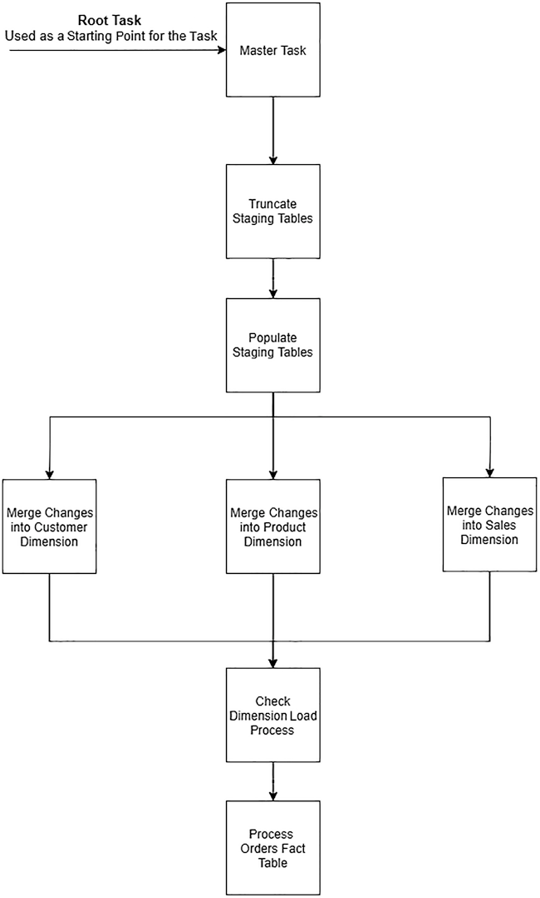
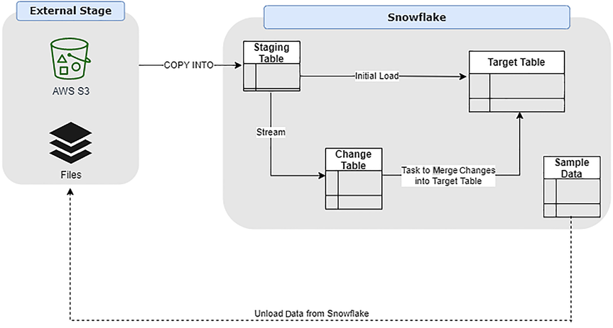

### Change Tracking Using Streams 

A stream object tracks any DML operations against the source table.This process is known as Change Data Capture.

* Change Data Capture (CDC) help streamline the movement of data.
    - If we have very large transaction table in our source system containing millions and millions of records, with 1000 new transactions being added per day, with no records change historically, we wouldn't want to reload the entire table each day. Using CDC against this table allows us to identify and target those 1000 records for extraction. This makes the entire process faster and more efficient.

* In  Snowflake, when we create a stream
    - a pair of hidden columns are added to the stream and they begin to store change tracking metadata.
    - A snapshot of source table is logically created which acts as baseline for all subsequent changes on the data can be identified.This baseline is referred as offset.
    - The stream also creates a change table, which stores both the before and after record between two points in time.This change table mirrors the structure of the source table along with the addition of some very handy change tracking columns.we can now point our processes to this change table and process the changed data.
    - Multiple queries can query the changed records from a stream without changing the offset. It is important to note that the offset is only moved when stream records are used within a DML transaction. Once the transaction commits, the offset moves forward, so we cannot reread thee same record again.

#### Stream Metadata Columns

These help us understand the nature of the changes applied to the source table, so we can process them correctly.

* METADATA$ACTION

    - Tells us what DML action was performed(INSERT or DELETE)
    - An update is effectively a DELETE followed by and INSERT

* METADATA$ISUPDATE

    - A Boolean value that indicated if the records were part of an UPDATE operation. When TRUE we would expect to see a pair of records, one with a DELETE and one with an INSERT

* METADATA$ROW_ID

    - A unique ID for the row.
    - Helpful for row level logging and auditability.

### Tasks

* Tasks execute a single SQL statement, giving us the ability to chain together a series of tasks and dependencies so we can execute them as required.

* A typical pattern is to have a task running every 10 minutes, which checks the stream for the presence of records to be processed using the system function **SYSTEM$STREAM_HAS_DATA('<stream_name>')**. If it returns FALSE, there are no records to process and task will exit.

* The task contains SQL logic that applies transformations or uses stored procedures or user-defined functions before merging those changes into a target table.

* We must specify a warehouse to use when we create a Task.
* Tasks require to have only one parent task, known as the root task. The root task must also have schedule associated with it. This can be a duration such as 5 minutes or a CRON expression.

A simple chain of tasks



* Child tasks can then be chained together to execute by using the CREATE TASK ... AFTER and specifying the name of the preceding task.

```
CREATE [ OR REPLACE ] TASK [IF NOT EXISTS ] <name>
WAREHOUSE = <string>
[ SCHEDULE = '{ <num> MINUTE | USING CRON <expr> <timezone>}' ]
[ ALLOW_OVERLAPPING_EXECUTION = TRUE | FALSE ]
[ <session_parameter> = <value> [ ,<session_parameter> = <value> ...]]
[ USER_TASK_TIMEOUT_MS = <num>]
[COPY GRANTS]
[ COMMENT = 'string_literal>' ]
[ AFTER <string> ]
[ WHEN <boolean_expr>]
AS
    <sql>

```
High-Level diagram 


```
--CREATE DATABASE

CREATE OR REPLACE DATABASE nse;

--SWITCH CONTEXT
USE DATABASE nse;

--CREATE SCHEMAS
```